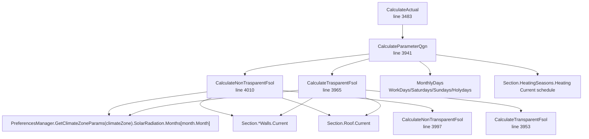
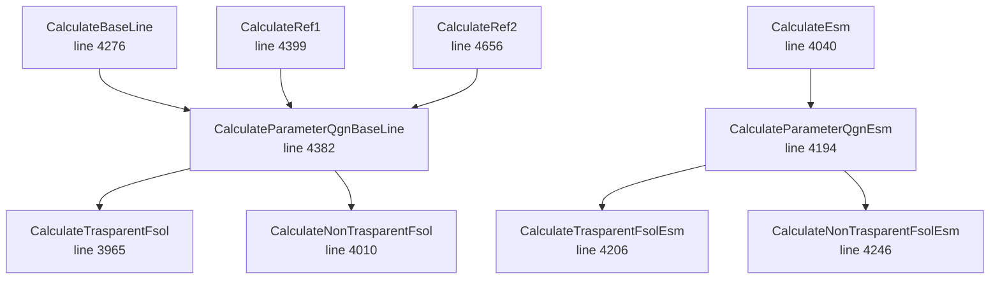

# R4 Qgn / Gains reverse engineering

## 1. Summary

Source of truth:

`reference/eecalc-decompiled/EECalcCore.Calculations.TableCalculations.HeatingAndCoolingResultCalc.cs`

Този документ описва EECalc-compatible reverse engineering за блока `Qgn` и вътрешните/соларните печалби. Не е имплементиран oracle и не са създавани тестове.

Ключово поведение:

- За отопление `CalculateActual` записва `monthData.ParameterQgn = CalculateParameterQgn(...) / 1000.0` на ред 3488.
- `CalculateParameterQgn` връща стойност преди деление на 1000 и включва само соларни печалби: `CalculateNonTrasparentFsol + CalculateTrasparentFsol`, умножени по общите часове за месеца.
- Метаболитната топлина от обитатели не влиза директно в `ParameterQgn`; тя се подава отделно като `latentHeatPerMonth * HeatedArea` в gamma на ред 3489.
- Осветление и балансирани уреди не се добавят в `ParameterQgn`; те се акумулират отделно през `CalculateLightsAndDevicesInputs` и `GetLightsAndDevicesInputs`.
- В decompiled source няма методи с имена `CalculateParameterQgnRef1` и `CalculateParameterQgnRef2`. Ref1 и Ref2 пътищата използват `CalculateParameterQgnBaseLine(...) / 1000.0`.
- Имената `CalculateTrasparentFsol` и `CalculateNonTrasparentFsol` са изписани с typo `Trasparent`; това трябва да се запази в test-only oracle, ако се следва EECalc naming.

## 2. Full call graph for CalculateParameterQgn



Baseline / ESM / reference variants:



## 3. Formula catalog

| Method | Formula | Inputs | Outputs | Source line |
|---|---|---|---|---|
| `CalculateActual` | `ParameterQgn = CalculateParameterQgn(section, climateZone, month) / 1000.0`; `Gamma = (ParameterQgn + latentHeatPerMonth * HeatedArea) / ParameterQht` | `CalculationData`, `Section`, `CalculationInput`, `MonthData`, `MonthlyDays`, `latentHeatPerMonth` | Mutates `monthData.ParameterQgn`, `ParameterGama`, `ParameterNi`, `NetEnergyQnd` | 3483-3491 |
| `CalculateParameterQgn` | `projectHours = WorkDays*(WorkCurrentEnd-WorkCurrentStart) + Sundays*(SunCurrentEnd-SunCurrentStart) + Saturdays*(SatCurrentEnd-SatCurrentStart)`; `nonProjectHours = WorkDays*(24-workDuration) + Saturdays*(24-satDuration) + Sundays*(24-sunDuration) + Holydays*24`; `QgnRaw = (NonTransparentFsol + TransparentFsol) * (projectHours + nonProjectHours)` | `Section.HeatingSeasons.Heating.Current`, `MonthlyDays`, `ClimateZones` | raw Qgn before `/1000` | 3941-3950 |
| `CalculateParameterQgnEsm` | Same as actual, but uses `WorkEsm/SunEsm/SatEsm` and ESM Fsol methods | `Section.HeatingSeasons.Heating.Esm`, `MonthlyDays`, `ClimateZones` | raw ESM Qgn before `/1000` | 4194-4203 |
| `CalculateParameterQgnBaseLine` | Same as actual, but uses `WorkBase/SunBase/SatBase`; still uses Current Fsol methods | `Section.HeatingSeasons.Heating.Base`, `MonthlyDays`, `ClimateZones` | raw baseline Qgn before `/1000` | 4382-4391 |
| `CalculateRef1` | `occupantHours = OccupantHours(section, month)`; `metabolic = MetabolicHeat * occupantHours / 1000`; `qgn = CalculateParameterQgnBaseLine(...) / 1000`; `gamma = (qgn + metabolic * HeatedArea) / (qtr + qve)` | Ref1 calculation data, section, month | Net energy for Ref1 path | 4399-4410 |
| `CalculateRef2` | Same pattern as Ref1: uses `CalculateParameterQgnBaseLine(...) / 1000` and `OccupantHours(section, month)` for metabolic heat | Ref2 calculation data, section, month | Net energy for Ref2 path | 4656-4667 |
| `CalculateTransparentFsol` | `radiativeCoeff = 4 * windowE * 0.0000000567 * 283^3`; `loss = 0.04 * windowG * windowA * 11 * radiativeCoeff`; `factor = horizontal ? 1.0 : 0.5`; `Fsol = windowA * windowG * sunShiningIntensity - factor * loss` | `windowA`, `windowG`, `windowE`, `sunShiningIntensity`, `horizontal` | transparent solar gain rate | 3953-3962 |
| `CalculateTrasparentFsol` | Sum `CalculateTransparentFsol` over 8 wall orientations using `*.Current.AccumulateWindowA/G/E`, plus 9 roof transparent elements using `Roof.Current.TransparentA/G/E`; roof element 9 uses `H` and `horizontal: true` | `Section`, `ClimateZones`, `MonthlyDays` | total transparent Fsol | 3965-3994 |
| `CalculateTrasparentFsolEsm` | Same as current, but uses `*.Esm` wall/roof fields | `Section`, `ClimateZones`, `MonthlyDays` | total ESM transparent Fsol | 4206-4243 |
| `CalculateNonTransparentFsol` | `absorbed = outerWallAlfa * 0.04 * outerWallU * outerWallArea`; `radiativeCoeff = 4 * outerWallEpsi * 0.0000000567 * 283^3`; `loss = 0.04 * outerWallU * outerWallArea * 11 * radiativeCoeff`; `factor = horizontal ? 1.0 : 0.5`; `Fsol = absorbed * sunShiningIntensity - factor * loss` | `outerWallAlfa`, `outerWallU`, `outerWallEpsi`, `outerWallArea`, `sunShiningIntensity`, `horizontal` | non-transparent solar gain rate | 3997-4007 |
| `CalculateNonTrasparentFsol` | Sum `CalculateNonTransparentFsol` over 8 wall orientations using `*.Current.AccumulateOuterAlfa/U/E/A`, plus one aggregated roof opaque term using `Roof.Current.AccumulateNonTransparentAlfa/U/E/A` with `H` and `horizontal: true` | `Section`, `ClimateZones`, `MonthlyDays` | total non-transparent Fsol | 4010-4031 |
| `CalculateNonTrasparentFsolEsm` | Same as current, but uses `*.Esm` wall/roof fields | `Section`, `ClimateZones`, `MonthlyDays` | total ESM non-transparent Fsol | 4246-4267 |
| `OccupantHours` | `WorkDays*(Occupants.WorkCurrentEnd-WorkCurrentStart) + Sundays*(SunCurrentEnd-SunCurrentStart) + Saturdays*(SatCurrentEnd-SatCurrentStart)` | `Section.HeatingSeasons.Occupants.Current`, `MonthlyDays` | heating occupant hours | 3467-3470 |
| `OccupantsHoursEsm` | Same shape using `Occupants.*Esm*` | `Section.HeatingSeasons.Occupants.Esm`, `MonthlyDays` | ESM heating occupant hours | 4034-4037 |
| `OccupantsHoursBaseLine` | Same shape using `Occupants.*Base*` | `Section.HeatingSeasons.Occupants.Base`, `MonthlyDays` | baseline heating occupant hours | 4270-4273 |
| `OccupantsHoursRef1` | Same as current occupant hours, but receives `tempSectionRef1` | `Section.HeatingSeasons.Occupants.Current`, `MonthlyDays` | Ref1 latent heat list hours | 4394-4397 |
| `OccupantsHoursRef2` | Same as current occupant hours, but receives `tempSectionRef2` | `Section.HeatingSeasons.Occupants.Current`, `MonthlyDays` | Ref2 latent heat list hours | 4652-4655 |
| `CalculateLightsAndDevicesInputs` | For lights/devices: energy = `Power * (WorkSchedule * month.Weeks) / 1000`; if `ByMonths`, `CalcAvgMonthPower(schedule, month) * (weekRegime * month.Weeks) / 1000`; then multiply by relevant `parameterEta` before adding to static lists | `CalculationData.Lights`, `CalculationData.BalancedDevices`, `MonthlyDays`, `parameterEta*` | Mutates `LigthsList*`, `DevicesList*` | 3494-3560 |
| `GetLightsAndDevicesInputs` | Sum each static list; if NaN/Infinity then `0`; assign `ResulLightInputs*` and `ResulAppliancesInputs*`; clear lists | `CalculationData`, static lists | Mutates result fields on `CalculationData` | 3562-3618 |
| `SumItemsList` | `sum = Aggregate(0, +)`; NaN/Infinity -> `0` | list of doubles | safe sum | 3620-3628 |
| `CalcAvgMonthPower` | Switch by `month.Month`, calls `CalcWeekPower(schedule.Month)` | `ScheduleMonth`, `MonthlyDays` | weekly average power for selected month | 6799-6817 |
| `CalcWeekPower` | `weekRegime = workDays * 5 + saturdays + sundays`; `avg = (workDays*workDaysUsedEnergy*5 + saturdays*saturdaysUsedEnergy + sundays*sundaysUsedEnergy) / weekRegime`; NaN/Infinity -> `0` | `MonthState` | average month schedule power and mutates static `weekRegime` | 6819-6834 |
| `CalculateQgain` cooling path | `Qgain = Qsol + Qint + Qoccupants` | `Section`, `ClimateZones`, `MonthlyDays`, `CalculationData` | cooling total gains | 1293-1298 |
| `CalculateQint` cooling path | If `ByMonths`: `CalcAvgMonthPower(...) * weekRegime * month.Weeks / 1000`; else `Cooling.PowerActual * Cooling.WorkScheduleActual * month.Weeks / 1000`; returned per area: `(lights + devices) * area` | lights/devices cooling inputs, month, area | cooling internal gains | 1331-1335 |
| `CalculateQoccupants` cooling path | `MetabolicHeat * CalculateOccupantshours / 1000 * HeatedArea` | section, month | cooling occupant gains | 1352-1356 |
| `CalculateOccupantshours` cooling path | Uses `Section.CoolingSeasons.Occupants.*Current*` with WorkDays, Saturdays, Sundays | section, month | cooling occupant hours | 1408-1413 |

## 4. Internal gains

### Heating `ParameterQgn`

В отоплителния път `ParameterQgn` не съдържа осветление, уреди или обитатели. На ред 3488 се използва само `CalculateParameterQgn(...) / 1000.0`, а самият метод на ред 3950 връща само:

```text
(CalculateNonTrasparentFsol(section, climateZone, month)
 + CalculateTrasparentFsol(section, climateZone, month))
* (projectHours + nonProjectHours)
```

### Отделни резултати за осветление и уреди

`CalculateLightsAndDevicesInputs` на ред 3494 акумулира осветление и `BalancedDevices` в отделни списъци, вече умножени по utilization factor (`parameterEta*`). След приключване на месечния цикъл `GetLightsAndDevicesInputs` на ред 3562 записва сумите в:

- `ResulLightInputsRef1`
- `ResulLightInputsref2`
- `ResulLightInputsActual`
- `ResulLightInputsBaseLine`
- `ResulLightInputsESM`
- `ResulAppliancesInputsRef1`
- `ResulAppliancesInputsRef2`
- `ResulAppliancesInputsActual`
- `ResulAppliancesInputsBaseLine`
- `ResulAppliancesInputsESM`

## 5. Occupants gains

Отоплителният actual път използва `latentHeatPerMonth` външно към `CalculateActual`. В `CalculateActual` gamma се изчислява като:

```text
Gamma = (ParameterQgn + latentHeatPerMonth * Section.Area.HeatedArea) / ParameterQht
```

Source: `CalculateActual`, ред 3489.

Методите за отоплителни occupant hours:

- `OccupantHours`, ред 3467: actual occupant hours.
- `OccupantsHoursEsm`, ред 4034: ESM occupant hours.
- `OccupantsHoursBaseLine`, ред 4270: baseline occupant hours.
- `OccupantsHoursRef1`, ред 4394: current occupant hours върху `tempSectionRef1`.
- `OccupantsHoursRef2`, ред 4652: current occupant hours върху `tempSectionRef2`.

Формула за actual:

```text
OccupantHours =
  WorkDays * (Occupants.WorkCurrentEnd - Occupants.WorkCurrentStart)
  + Sundays * (Occupants.SunCurrentEnd - Occupants.SunCurrentStart)
  + Saturdays * (Occupants.SatCurrentEnd - Occupants.SatCurrentStart)
```

Ref1/Ref2 в `CalculateRef1` и `CalculateRef2` използват `OccupantHours(section, month)` за gamma, но `OccupantsHoursRef1/Ref2` за latent heat list output.

Cooling path има отделни методи `CalculateQoccupants`, `CalculateQoccupantsBaseLine`, `CalculateQoccupantsESM` на редове 1352-1368, но те използват `Section.CoolingSeasons.Occupants` чрез `CalculateOccupantshours*` на редове 1408-1429. Това е охлаждане, не отоплителен `ParameterQgn`.

## 6. Lights gains

Heating result inputs за осветление се изчисляват в `CalculateLightsAndDevicesInputs`, редове 3494-3527:

Ако `Lights.ByMonths == true`:

```text
LightActualMonthly =
  CalcAvgMonthPower(Lights.Actual, month)
  * (weekRegime * month.Weeks)
  / 1000

LigthsList.Add(LightActualMonthly * parameterEta)
```

Ако `Lights.ByMonths == false`:

```text
LightActualMonthly =
  Lights.Heating.PowerActual
  * (Lights.Heating.WorkScheduleActual * month.Weeks)
  / 1000

LigthsList.Add(LightActualMonthly * parameterEta)
```

Същият pattern се използва за `Ref1`, `Ref2`, `BaseLine`, `ESM`, с различни `Power*`, `WorkSchedule*` и `parameterEta*`.

`parameterEta` е месечният utilization factor (`Ni`) от съответния режим, подаден към `CalculateLightsAndDevicesInputs` на ред 3290.

## 7. Appliances/devices gains

Heating result inputs за уреди използват само `BalancedDevices`, не `NonBalancedDevices`, в `CalculateLightsAndDevicesInputs`, редове 3528-3559.

Ако `BalancedDevices.ByMonths == true`:

```text
DevicesActualMonthly =
  CalcAvgMonthPower(BalancedDevices.Actual, month)
  * (weekRegime * month.Weeks)
  / 1000

DevicesList.Add(DevicesActualMonthly * parameterEta)
```

Ако `BalancedDevices.ByMonths == false`:

```text
DevicesActualMonthly =
  BalancedDevices.Heating.PowerActual
  * (BalancedDevices.Heating.WorkScheduleActual * month.Weeks)
  / 1000

DevicesList.Add(DevicesActualMonthly * parameterEta)
```

`NonBalancedDevices` присъства по-късно в helper/reporting blocks, но не е част от `CalculateLightsAndDevicesInputs` за отоплителните result input fields.

## 8. Transparent solar gains

Primitive formula from `CalculateTransparentFsol`, редове 3953-3962:

```text
radiativeCoeff = 4 * windowE * 0.0000000567 * 283^3
loss = 0.04 * windowG * windowA * 11 * radiativeCoeff
directionFactor = horizontal ? 1.0 : 0.5
transparentFsol =
  windowA * windowG * sunShiningIntensity
  - directionFactor * loss
```

Wall transparent source fields for actual/current:

```text
Walls.Current.AccumulateWindowA
Walls.Current.AccumulateWindowG
Walls.Current.AccumulateWindowE
```

Roof transparent source fields:

```text
Roof.Current.TransparentA1..A9
Roof.Current.TransparentG1..G9
Roof.Current.TransparentE1..E9
```

Element 6 uses the Cyrillic property name in decompiled output:

```text
TransparentРђ6 / TransparentА6
```

Source lines: 3985-3993.

## 9. Non-transparent solar gains

Primitive formula from `CalculateNonTransparentFsol`, редове 3997-4007:

```text
absorbed = outerWallAlfa * 0.04 * outerWallU * outerWallArea
radiativeCoeff = 4 * outerWallEpsi * 0.0000000567 * 283^3
loss = 0.04 * outerWallU * outerWallArea * 11 * radiativeCoeff
directionFactor = horizontal ? 1.0 : 0.5
nonTransparentFsol =
  absorbed * sunShiningIntensity
  - directionFactor * loss
```

Wall non-transparent source fields:

```text
Walls.Current.AccumulateOuterAlfa
Walls.Current.AccumulateOuterU
Walls.Current.AccumulateOuterE
Walls.Current.AccumulateOuterA
```

Roof non-transparent source fields are aggregate values, not element-by-element:

```text
Roof.Current.AccumulateNonTransparentAlfa
Roof.Current.AccumulateNonTransparentU
Roof.Current.AccumulateNonTransparentE
Roof.Current.AccumulateNonTransparentA
```

Source lines: 4010-4031.

## 10. Roof solar gains

Transparent roof uses 9 separate roof elements:

| Roof element | Radiation |
|---|---|
| `TransparentA1/G1/E1` | `N` |
| `TransparentA2/G2/E2` | `(N + E) / 2` |
| `TransparentA3/G3/E3` | `E` |
| `TransparentA4/G4/E4` | `(S + E) / 2` |
| `TransparentA5/G5/E5` | `S` |
| `TransparentА6/G6/E6` | `(S + W) / 2` |
| `TransparentA7/G7/E7` | `W` |
| `TransparentA8/G8/E8` | `(N + W) / 2` |
| `TransparentA9/G9/E9` | `H`, `horizontal: true` |

Source lines: 3985-3993 and ESM lines 4226-4242.

Non-transparent roof solar gain uses a single aggregated horizontal term:

```text
CalculateNonTransparentFsol(
  Roof.Current.AccumulateNonTransparentAlfa,
  Roof.Current.AccumulateNonTransparentU,
  Roof.Current.AccumulateNonTransparentE,
  Roof.Current.AccumulateNonTransparentA,
  solarRadiation.H,
  horizontal: true)
```

Source lines: 4029-4030 and ESM lines 4265-4266.

## 11. Directional radiation mapping

Solar radiation source:

```text
PreferencesManager.GetClimateZoneParams(climateZone)
  .SolarRadiation.Months[(int)month.Month]
```

Source lines: 3967, 4012, 4208, 4248.

Mapping for walls and roof transparent elements:

| Direction / element | Radiation |
|---|---|
| North | `N` |
| NorthEast | `(N + E) / 2` |
| East | `E` |
| SouthEast | `(S + E) / 2` |
| South | `S` |
| SouthWest | `(S + W) / 2` |
| West | `W` |
| NorthWest | `(N + W) / 2` |
| Horizontal roof element 9 / opaque roof aggregate | `H` with `horizontal: true` |

## 12. Project/non-project hour logic

For heating Qgn actual, `CalculateParameterQgn` uses:

```text
projectHours =
  WorkDays * (WorkCurrentEnd - WorkCurrentStart)
  + Sundays * (SunCurrentEnd - SunCurrentStart)
  + Saturdays * (SatCurrentEnd - SatCurrentStart)

nonProjectHours =
  WorkDays * (24 - (WorkCurrentEnd - WorkCurrentStart))
  + Saturdays * (24 - (SatCurrentEnd - SatCurrentStart))
  + Sundays * (24 - (SunCurrentEnd - SunCurrentStart))
  + Holydays * 24

totalHours = projectHours + nonProjectHours
```

Source lines: 3943-3949.

For baseline and ESM the same structure is used with `Base` and `Esm` schedule fields:

- Baseline: lines 4384-4390.
- ESM: lines 4196-4202.

Important consequence: because the return formula uses only `projectHours + nonProjectHours`, the split between project and non-project schedule does not change `Qgn` as long as total counted days are unchanged. Holidays only appear in `nonProjectHours`.

## 13. EECalc quirks / suspicious bugs

Candidate known differences for R4:

- **KD-R4-001: Heating `ParameterQgn` excludes internal gains.** `CalculateParameterQgn` includes only solar Fsol terms. Occupant metabolic heat is added separately into gamma; lights/devices are accumulated separately into result fields.
- **KD-R4-002: Ref1/Ref2 have no dedicated `CalculateParameterQgnRef1/Ref2` methods.** Both `CalculateRef1` and `CalculateRef2` call `CalculateParameterQgnBaseLine(...) / 1000.0`.
- **KD-R4-003: Baseline Qgn uses Current envelope solar methods.** `CalculateParameterQgnBaseLine` uses `CalculateNonTrasparentFsol` and `CalculateTrasparentFsol`, not separate baseline envelope Fsol methods.
- **KD-R4-004: Project/non-project split is calculated but effectively collapsed.** `CalculateParameterQgn*` returns solar gain rate multiplied by `projectHours + nonProjectHours`; project/non-project temperatures are not used in Qgn.
- **KD-R4-005: Spelling quirks are source-of-truth.** Methods are named `CalculateTrasparentFsol` and `CalculateNonTrasparentFsol`.
- **KD-R4-006: Roof transparent element 6 uses Cyrillic A property mapping.** Decompiled output shows `TransparentРђ6` / `TransparentА6`; oracle must bind to the actual compiled member used by the project model.
- **KD-R4-007: Non-transparent roof solar gain uses aggregate roof properties only.** It does not iterate over non-transparent roof elements 1..9 in `CalculateNonTrasparentFsol`.
- **KD-R4-008: `CalcWeekPower` mutates static `weekRegime`.** `CalculateLightsAndDevicesInputs` relies on `CalcAvgMonthPower` setting `weekRegime` before using `weekRegime * month.Weeks`.
- **KD-R4-009: Heating result inputs use `BalancedDevices` only.** `NonBalancedDevices` is not included in `CalculateLightsAndDevicesInputs`.
- **KD-R4-010: ESM Htr nearby contains suspicious Current roof/floor usage, but Qgn ESM itself uses ESM Fsol.** Not part of Qgn oracle unless shared setup reuses ESM Htr/Ni.

## 14. Required input fields

### `Section`

Heating schedule:

- `Section.HeatingSeasons.Heating.WorkCurrentStart/End`
- `Section.HeatingSeasons.Heating.SatCurrentStart/End`
- `Section.HeatingSeasons.Heating.SunCurrentStart/End`
- `Section.HeatingSeasons.Heating.WorkBaseStart/End`
- `Section.HeatingSeasons.Heating.SatBaseStart/End`
- `Section.HeatingSeasons.Heating.SunBaseStart/End`
- `Section.HeatingSeasons.Heating.WorkEsmStart/End`
- `Section.HeatingSeasons.Heating.SatEsmStart/End`
- `Section.HeatingSeasons.Heating.SunEsmStart/End`

Occupants:

- `Section.HeatingSeasons.Occupants.WorkCurrentStart/End`
- `Section.HeatingSeasons.Occupants.SatCurrentStart/End`
- `Section.HeatingSeasons.Occupants.SunCurrentStart/End`
- `Section.HeatingSeasons.Occupants.WorkBaseStart/End`
- `Section.HeatingSeasons.Occupants.SatBaseStart/End`
- `Section.HeatingSeasons.Occupants.SunBaseStart/End`
- `Section.HeatingSeasons.Occupants.WorkEsmStart/End`
- `Section.HeatingSeasons.Occupants.SatEsmStart/End`
- `Section.HeatingSeasons.Occupants.SunEsmStart/End`

Area/metabolic:

- `Section.Area.HeatedArea`
- `Section.Area.MetabolicHeat`
- `Section.Area.LatentMetabolicHeat` if latent list outputs are validated later

Walls for all 8 directions, `Current` and optionally `Esm`:

- `AccumulateWindowA`
- `AccumulateWindowG`
- `AccumulateWindowE`
- `AccumulateOuterAlfa`
- `AccumulateOuterU`
- `AccumulateOuterE`
- `AccumulateOuterA`

Roof `Current` and optionally `Esm`:

- `TransparentA1..A9`
- `TransparentG1..G9`
- `TransparentE1..E9`
- `TransparentА6` / actual Cyrillic member for element 6
- `AccumulateNonTransparentAlfa`
- `AccumulateNonTransparentU`
- `AccumulateNonTransparentE`
- `AccumulateNonTransparentA`

### `MonthlyDays`

- `Month`
- `WorkDays`
- `Saturdays`
- `Sundays`
- `Holydays`
- `Weeks`

### `CalculationData`

For lights:

- `Lights.ByMonths`
- `Lights.Actual/BaseLine/Esm` monthly schedules
- `Lights.Heating.PowerActual/BaseLine/ESM/Ref1/Ref2`
- `Lights.Heating.WorkScheduleActual/BaseLine/ESM/Ref1/Ref2`

For appliances/devices:

- `BalancedDevices.ByMonths`
- `BalancedDevices.Actual/BaseLine/Esm` monthly schedules
- `BalancedDevices.Heating.PowerActual/BaseLine/ESM/Ref1/Ref2`
- `BalancedDevices.Heating.WorkScheduleActual/BaseLine/ESM/Ref1/Ref2`

Output/result fields:

- `ResulLightInputsRef1`
- `ResulLightInputsref2`
- `ResulLightInputsActual`
- `ResulLightInputsBaseLine`
- `ResulLightInputsESM`
- `ResulAppliancesInputsRef1`
- `ResulAppliancesInputsRef2`
- `ResulAppliancesInputsActual`
- `ResulAppliancesInputsBaseLine`
- `ResulAppliancesInputsESM`

### `ClimateZone`

From `PreferencesManager.GetClimateZoneParams(climateZone).SolarRadiation.Months[(int)month.Month]`:

- `N`
- `E`
- `S`
- `W`
- `H`
- `AvgTemp` is not used by Qgn/Fsol directly, but appears in adjacent Qtr/Qve/Gamma logic.

### Source binding addendum

`PreferencesManager` loads `Xml/DefaultParams.xml`, so all R4 heating/cooling Fsol orientation radiation values come from:

- `DefaultParams.xml` `SolarRadiation/Months/Month/N`
- `DefaultParams.xml` `SolarRadiation/Months/Month/E`
- `DefaultParams.xml` `SolarRadiation/Months/Month/S`
- `DefaultParams.xml` `SolarRadiation/Months/Month/W`
- `DefaultParams.xml` `SolarRadiation/Months/Month/H`

`DefaultSunParams.xml` is not used by R4 `Qgn`, `Qsol`, `CalculateTrasparentFsol*`, or `CalculateNonTrasparentFsol*`.

The selected climate zone is `calcInput.General.ClimateZone`, matched to `DefaultParams.xml` `ClimateZone.Number` as a zero-based EECalc value. For current ordinance/json comparisons, `ZoneId = Number + 1`.

See `analysis/reference-data/source_binding_audit_heating_cooling_ventilation.md` for the consolidated R1-R7 data-source binding audit.

## 15. Proposed test-only oracle design

### `EecalcQgnOracle`

Responsibilities:

- Implement `CalculateParameterQgn`, `CalculateParameterQgnBaseLine`, `CalculateParameterQgnEsm`.
- Expose helper methods for `CalculateTransparentFsol`, `CalculateTrasparentFsol`, `CalculateNonTransparentFsol`, `CalculateNonTrasparentFsol`.
- Preserve exact EECalc behavior:
  - baseline uses Current Fsol.
  - Ref1/Ref2 use baseline Qgn helper, not separate Ref Qgn.
  - total hours are `projectHours + nonProjectHours`.
  - roof opaque solar uses aggregate roof values.

Suggested methods:

```text
CalculateParameterQgnActual(fixture, month, solar)
CalculateParameterQgnBaseLine(fixture, month, solar)
CalculateParameterQgnEsm(fixture, month, solar)
CalculateTransparentFsol(windowA, windowG, windowE, radiation, horizontal)
CalculateTrasparentFsol(envelopeState, solar)
CalculateNonTransparentFsol(alpha, u, epsilon, area, radiation, horizontal)
CalculateNonTrasparentFsol(envelopeState, solar)
CalculateProjectHours(schedule, month)
CalculateNonProjectHours(schedule, month)
```

### `EecalcGainsFixture`

Suggested fields:

- `FixtureId`
- `HeatedArea`
- `MetabolicHeat`
- `LatentMetabolicHeat`
- `MonthlyDays`
- `HeatingSchedules`: actual/baseLine/esm project schedule.
- `OccupantSchedules`: actual/baseLine/esm occupant schedule.
- `SolarRadiationByMonth`: `N/E/S/W/H`
- `WallSolarInputs` for eight directions.
- `RoofTransparentInputs` for nine elements.
- `RoofOpaqueAggregateInputs`.
- `LightsInputs`
- `BalancedDevicesInputs`

### `EecalcSolarSnapshotRow`

Suggested columns:

- `fixture`
- `month`
- `mode`
- `radiationN`
- `radiationE`
- `radiationS`
- `radiationW`
- `radiationH`
- `projectHours`
- `nonProjectHours`
- `totalHours`
- `transparentWallsFsol`
- `transparentRoofFsol`
- `nonTransparentWallsFsol`
- `nonTransparentRoofFsol`
- `transparentFsol`
- `nonTransparentFsol`
- `qgnRaw`
- `qgnKwh`

### `EecalcInternalGainsSnapshotRow`

Suggested columns:

- `fixture`
- `month`
- `mode`
- `occupantHours`
- `metabolicHeat`
- `occupantSensibleKwh`
- `latentMetabolicHeat`
- `occupantLatentKwh`
- `lightsByMonths`
- `lightsPower`
- `lightsSchedule`
- `lightsBeforeEtaKwh`
- `lightsEta`
- `lightsAfterEtaKwh`
- `balancedDevicesByMonths`
- `balancedDevicesPower`
- `balancedDevicesSchedule`
- `balancedDevicesBeforeEtaKwh`
- `balancedDevicesEta`
- `balancedDevicesAfterEtaKwh`
- `weekRegime`
- `weeks`

## 16. Minimal fixture plan

1. **No gains**
   - All transparent and opaque solar areas zero.
   - Occupants, lights, devices zero.
   - Expected `Qgn = 0`.

2. **Only occupants**
   - Solar zero.
   - Lights/devices zero.
   - Validate occupant hours and gamma input path separately; expected `ParameterQgn = 0`, but occupant metabolic contribution is non-zero in gamma.

3. **Only lights**
   - Solar zero.
   - Occupants/devices zero.
   - Validate `CalculateLightsAndDevicesInputs` result fields; expected `ParameterQgn = 0`.

4. **Only appliances**
   - Solar zero.
   - Occupants/lights zero.
   - Validate `BalancedDevices` result fields; expected `ParameterQgn = 0`.

5. **Only south window**
   - `SouthWalls.Current.AccumulateWindowA/G/E` non-zero.
   - All other solar inputs zero.
   - Expected transparent solar from `S` only.

6. **Only north window**
   - `NorthWalls.Current.AccumulateWindowA/G/E` non-zero.
   - Expected transparent solar from `N` only.

7. **Only horizontal roof transparent**
   - `Roof.Current.TransparentA9/G9/E9` non-zero.
   - Expected `H` radiation and `horizontal: true` factor `1.0`.

8. **Only opaque wall solar gain**
   - One wall direction, e.g. South, with `AccumulateOuterAlfa/U/E/A` non-zero.
   - Expected non-transparent solar from `S` only.

## 17. Implementation notes for later oracle

- Do not compare R4 against EE.Doklad until the oracle can emit separate rows for:
  - transparent wall Fsol
  - transparent roof Fsol
  - non-transparent wall Fsol
  - non-transparent roof Fsol
  - project/non-project/total hours
  - raw Qgn before `/1000`
  - final Qgn after `/1000`
- Keep R4 oracle independent from R3 Htr/Qtr oracle except for shared fixture primitives if needed.
- Preserve EECalc spelling and quirks in comments/reporting names, but expose clean C# method names only if the wrapper maps explicitly to source method names.
- For parity debugging, always record whether Qgn difference is from:
  - radiation values,
  - direction mapping,
  - roof element mapping,
  - total hours,
  - primitive Fsol loss term,
  - inclusion/exclusion of internal gains.
