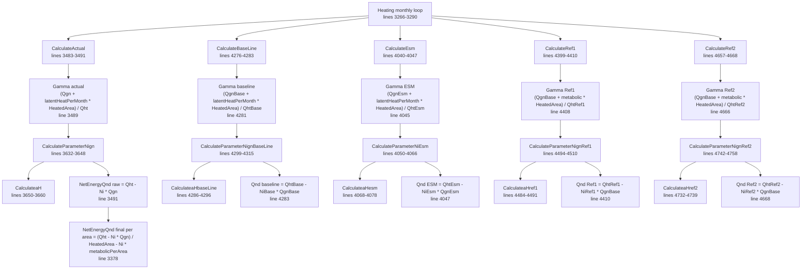

# R5 Gamma / Ni reverse engineering

## 1. Summary

Source of truth:

`reference/eecalc-decompiled/EECalcCore.Calculations.TableCalculations.HeatingAndCoolingResultCalc.cs`

Целта на този документ е да опише EECalc pipeline:

```text
Gamma -> Ni -> Qnd
```

Фокусирани методи:

- `CalculateParameterNign`
- `CalculateParameterNignBaseLine`
- `CalculateParameterNiEsm`

Допълнително са описани Ref1/Ref2, защото използват същата Ni формула, но различни `aH`, Htr/Hve и Qgn входове.

Няма имплементиран oracle и не е променян production code.

## 2. Call graph: Gamma -> Ni -> Qnd



## 3. Exact Gamma formula

### Actual

Source: `CalculateActual`, lines 3483-3491.

```text
Qtr = CalculateParameterQtr(...)
Qve = CalculateParameterQve(...)
Qht = Qtr + Qve
Qgn = CalculateParameterQgn(...) / 1000.0
Gamma = (Qgn + latentHeatPerMonth * Section.Area.HeatedArea) / Qht
Ni = CalculateParameterNign(..., Gamma, ...)
NetEnergyQnd = Qht - Ni * Qgn
```

Important: `latentHeatPerMonth` is already derived before `CalculateActual` as:

```text
occupantHours = OccupantHours(section, month)
latentHeatPerMonth = Section.Area.MetabolicHeat * occupantHours / 1000.0
```

Source: monthly loop lines 3275-3277.

### Baseline

Source: `CalculateBaseLine`, lines 4276-4283.

```text
QhtBase = QtrBase + QveBase
QgnBase = CalculateParameterQgnBaseLine(...) / 1000.0
GammaBase = (QgnBase + latentHeatPerMonth * Section.Area.HeatedArea) / QhtBase
NiBase = CalculateParameterNignBaseLine(..., GammaBase, ...)
QndBase = QhtBase - NiBase * QgnBase
```

### ESM

Source: `CalculateEsm`, lines 4040-4047.

```text
QhtEsm = QtrEsm + QveEsm
QgnEsm = CalculateParameterQgnEsm(...) / 1000.0
GammaEsm = (QgnEsm + latentHeatPerMonth * Section.Area.HeatedArea) / QhtEsm
NiEsm = CalculateParameterNiEsm(..., GammaEsm, ...)
QndEsm = QhtEsm - NiEsm * QgnEsm
```

### Ref1

Source: `CalculateRef1`, lines 4399-4410.

```text
occupantHours = OccupantHours(section, month)
metabolic = Section.Area.MetabolicHeat * occupantHours / 1000.0
QhtRef1 = QtrRef1 + QveRef1
QgnRef1Input = CalculateParameterQgnBaseLine(...) / 1000.0
GammaRef1 = (QgnRef1Input + metabolic * Section.Area.HeatedArea) / QhtRef1
NiRef1 = CalculateParameterNignRef1(..., GammaRef1, ...)
QndRef1 = QhtRef1 - NiRef1 * QgnRef1Input
```

There is no separate `CalculateParameterQgnRef1`; Ref1 uses baseline Qgn.

### Ref2

Source: `CalculateRef2`, lines 4657-4668.

```text
occupantHours = OccupantHours(section, month)
metabolic = Section.Area.MetabolicHeat * occupantHours / 1000.0
QhtRef2 = QtrRef2 + QveRef2
QgnRef2Input = CalculateParameterQgnBaseLine(...) / 1000.0
GammaRef2 = (QgnRef2Input + metabolic * Section.Area.HeatedArea) / QhtRef2
NiRef2 = CalculateParameterNignRef2(..., GammaRef2, ...)
QndRef2 = QhtRef2 - NiRef2 * QgnRef2Input
```

There is no separate `CalculateParameterQgnRef2`; Ref2 uses baseline Qgn.

## 4. Exact Ni formula and branching logic

All five Ni methods use the same piecewise equation:

- `CalculateParameterNign`, lines 3632-3648.
- `CalculateParameterNiEsm`, lines 4050-4066.
- `CalculateParameterNignBaseLine`, lines 4299-4315.
- `CalculateParameterNignRef1`, lines 4494-4510.
- `CalculateParameterNignRef2`, lines 4742-4758.

Formula:

```text
aH = CalculateaH*(...)

if gamma > 0.0 && Abs(gamma - 1.0) > 0.01:
    Ni = (1.0 - gamma^aH) / (1.0 - gamma^(aH + 1.0))

if gamma < 0.0:
    Ni = 1.0

if Abs(gamma - 1.0) < 0.01:
    Ni = aH / (aH + 1.0)

else:
    Ni = 0.0
```

Boundary behavior:

| Gamma condition | Result |
|---|---|
| `gamma > 0` and `abs(gamma - 1) > 0.01` | power formula |
| `gamma < 0` | `1.0` |
| `abs(gamma - 1) < 0.01` | `aH / (aH + 1)` |
| `gamma == 0` | `0.0` |
| `gamma == 0.99` or `1.01` exactly | `0.0`, because comparisons are strict `> 0.01` and `< 0.01` |
| `gamma = NaN` | `0.0`, because comparisons fail |
| `gamma = +Infinity` | enters power formula; no local NaN/Infinity guard |

There are no lookup tables in the Ni formula itself.

## 5. `aH` formula

The common conceptual formula is:

```text
Htr = Hd + Hg + Hu
Hve = ventilation heat transfer coefficient
tau = HeatedArea * HeatCapacity / (Htr + Hve)
aH = 1.0 + tau / 15.0
```

No clamping or NaN/Infinity handling is applied inside the `aH` methods.

### Actual `CalculateaH`

Source: lines 3650-3660.

```text
avgTemp = Climate.SolarRadiation.Months[month.Month].AvgTemp
averageInnerHeatTemp = CalculateAverageHeatTempCurrent(section, calculationdata, month)
huWalls = SumWallDirecrionsHu1(section, avgTemp, averageInnerHeatTemp)
huCeilings = CalcCeilingsParameterHu2(section.Roof.Current, avgTemp, averageInnerHeatTemp)
huFloors = CalcFloorsParameterHu3(section.Floor.Current, avgTemp, averageInnerHeatTemp)
Htr = CalculateParameterHdCurrent(section)
    + CalculateParameterHgCurrent(section)
    + (huWalls + huCeilings + huFloors)
Hve = CalcParameterHve(section, calculationdata)
tau = section.Area.HeatedArea * section.Area.HeatCapacity / (Htr + Hve)
aH = 1.0 + tau / 15.0
```

Dependencies:

- `PreferencesManager.GetClimateZoneParams(...).SolarRadiation.Months[(int)month.Month].AvgTemp`
- `CalculateAverageHeatTempCurrent`
- `SumWallDirecrionsHu1`
- `CalcCeilingsParameterHu2`
- `CalcFloorsParameterHu3`
- `CalculateParameterHdCurrent`
- `CalculateParameterHgCurrent`
- `CalcParameterHve`

### Baseline `CalculateaHbaseLine`

Source: lines 4286-4296.

```text
avgTemp = Climate.SolarRadiation.Months[month.Month].AvgTemp
averageInnerHeatTemp = CalculateAverageHeatTempBaseLine(section, calculationdata, month)
huWalls = SumWallDirecrionsHu1(section, avgTemp, averageInnerHeatTemp)
huCeilings = CalcCeilingsParameterHu2(section.Roof.Current, avgTemp, averageInnerHeatTemp)
huFloors = CalcFloorsParameterHu3(section.Floor.Current, avgTemp, averageInnerHeatTemp)
Htr = CalculateParameterHdCurrent(section)
    + CalculateParameterHgCurrent(section)
    + (huWalls + huCeilings + huFloors)
Hve = CalcParameterHveBaseLine(section, calculationdata)
tau = section.Area.HeatedArea * section.Area.HeatCapacity / (Htr + Hve)
aH = 1.0 + tau / 15.0
```

Baseline uses Current envelope/Hd/Hg/Hu functions and baseline temperatures/Hve.

### ESM `CalculateaHesm`

Source: lines 4068-4078.

```text
avgTemp = Climate.SolarRadiation.Months[month.Month].AvgTemp
averageInnerHeatTemp = CalculateAverageHeatTempEsm(section, calculationdata, month)
huWalls = SumWallDirecrionsHu1Esm(section, avgTemp, averageInnerHeatTemp)
huCeilings = CalcCeilingsParameterHu2(section.Roof.Esm, avgTemp, averageInnerHeatTemp)
huFloors = CalcFloorsParameterHu3(section.Floor.Esm, avgTemp, averageInnerHeatTemp)
Htr = CalculateParameterHdEsm(section)
    + CalculateParameterHgEsm(section)
    + (huWalls + huCeilings + huFloors)
Hve = CalcParameterHveEsm(section, calculationdata)
tau = section.Area.HeatedArea * section.Area.HeatCapacity / (Htr + Hve)
aH = 1.0 + tau / 15.0
```

### Ref1 `CalculateaHref1`

Source: lines 4484-4491.

```text
avgTemp = Climate.SolarRadiation.Months[month.Month].AvgTemp
averageInnerHeatTemp = CalculateAverageHeatTempRef1(tempSection, calculationdata, month)
Htr = CalculateParameterHtr(tempSection, avgTemp, averageInnerHeatTemp)
Hve = CalcParameterHveRef1(tempSection, calculationdata)
tau = tempSection.Area.HeatedArea * tempSection.Area.HeatCapacity / (Htr + Hve)
aH = 1.0 + tau / 15.0
```

Ref1 uses `CalculateParameterHtr` on a temp section modified by `ApplyValuesToTempSectionRef1`.

### Ref2 `CalculateaHref2`

Source: lines 4732-4739.

```text
avgTemp = Climate.SolarRadiation.Months[month.Month].AvgTemp
averageInnerHeatTemp = CalculateAverageHeatTempRef2(tempSection, calculationdata, month)
Htr = CalculateParameterHtrRef(tempSection, avgTemp, averageInnerHeatTemp)
Hve = CalcParameterHveRef2(tempSection, calculationdata)
tau = tempSection.Area.HeatedArea * tempSection.Area.HeatCapacity / (Htr + Hve)
aH = 1.0 + tau / 15.0
```

Ref2 uses `CalculateParameterHtrRef` on a temp section modified by `ApplyValuesToTempSectionRef2`.

## 6. Method-by-method dependency index

| Method | Formula | Inputs | Outputs | Dependencies | Source lines |
|---|---|---|---|---|---|
| `CalculateActual` | `Qht=Qtr+Qve`; `Qgn=QgnRaw/1000`; `Gamma=(Qgn+latentHeatPerMonth*HeatedArea)/Qht`; `Ni=CalculateParameterNign`; `NetEnergyQnd=Qht-Ni*Qgn` | `CalculationData`, `Section`, `CalculationInput`, `MonthData`, `MonthlyDays`, `latentHeatPerMonth` | Mutates `MonthData` | `CalculateParameterQtr`, `CalculateParameterQve`, `CalculateParameterQgn`, `CalculateParameterNign` | 3483-3491 |
| `CalculateParameterNign` | Piecewise Ni formula using `aH` | `CalculationData`, `ClimateZones`, `MonthlyDays`, `gamma`, `Section` | `Ni` | `CalculateaH`, `Math.Pow`, `Math.Abs` | 3632-3648 |
| `CalculateaH` | `1 + (HeatedArea*HeatCapacity/(Htr+Hve))/15` | actual section/data/month/climate | `aH` | climate `AvgTemp`, `CalculateAverageHeatTempCurrent`, `SumWallDirecrionsHu1`, `CalcCeilingsParameterHu2`, `CalcFloorsParameterHu3`, `CalculateParameterHdCurrent`, `CalculateParameterHgCurrent`, `CalcParameterHve` | 3650-3660 |
| `CalculateBaseLine` | `QhtBase=QtrBase+QveBase`; `QgnBase=QgnBaseRaw/1000`; `GammaBase=(QgnBase+latentHeatPerMonth*HeatedArea)/QhtBase`; `QndBase=QhtBase-NiBase*QgnBase` | baseline section/data/month/climate | baseline net energy | `CalculateParameterQtrBaseLine`, `CalculateParameterQveBaseLIne`, `CalculateParameterQgnBaseLine`, `CalculateParameterNignBaseLine` | 4276-4283 |
| `CalculateParameterNignBaseLine` | Same piecewise Ni formula | `CalculationData`, `ClimateZones`, `MonthlyDays`, `gamma`, `Section` | `NiBase` | `CalculateaHbaseLine`, `Math.Pow`, `Math.Abs` | 4299-4315 |
| `CalculateaHbaseLine` | `1 + (HeatedArea*HeatCapacity/(HtrCurrentEnvelope+HveBase))/15` | baseline section/data/month/climate | baseline `aH` | climate `AvgTemp`, `CalculateAverageHeatTempBaseLine`, Current Htr components, `CalcParameterHveBaseLine` | 4286-4296 |
| `CalculateEsm` | `QhtEsm=QtrEsm+QveEsm`; `QgnEsm=QgnEsmRaw/1000`; `GammaEsm=(QgnEsm+latentHeatPerMonth*HeatedArea)/QhtEsm`; `QndEsm=QhtEsm-NiEsm*QgnEsm` | ESM section/data/month/climate | ESM net energy | `CalculateParameterQtrEsm`, `CalculateParameterQveEsm`, `CalculateParameterQgnEsm`, `CalculateParameterNiEsm` | 4040-4047 |
| `CalculateParameterNiEsm` | Same piecewise Ni formula | `CalculationData`, `ClimateZones`, `MonthlyDays`, `gamma`, `Section` | `NiEsm` | `CalculateaHesm`, `Math.Pow`, `Math.Abs` | 4050-4066 |
| `CalculateaHesm` | `1 + (HeatedArea*HeatCapacity/(HtrEsm+HveEsm))/15` | ESM section/data/month/climate | ESM `aH` | climate `AvgTemp`, `CalculateAverageHeatTempEsm`, `SumWallDirecrionsHu1Esm`, `CalcCeilingsParameterHu2(Roof.Esm)`, `CalcFloorsParameterHu3(Floor.Esm)`, `CalculateParameterHdEsm`, `CalculateParameterHgEsm`, `CalcParameterHveEsm` | 4068-4078 |
| `CalculateRef1` | `GammaRef1=(QgnBase+metabolic*HeatedArea)/QhtRef1`; `QndRef1=QhtRef1-NiRef1*QgnBase` | Ref1 temp section/data/month/climate | Ref1 net energy | `OccupantHours`, `CalculateParameterQtrRef1`, `CalculateParameterQveRef1`, `CalculateParameterQgnBaseLine`, `CalculateParameterNignRef1` | 4399-4410 |
| `CalculateParameterNignRef1` | Same piecewise Ni formula | Ref1 data/month/climate/gamma/section | `NiRef1` | `CalculateaHref1` | 4494-4510 |
| `CalculateaHref1` | `1 + (HeatedArea*HeatCapacity/(HtrRef1+HveRef1))/15` | Ref1 temp section/data/month/climate | Ref1 `aH` | climate `AvgTemp`, `CalculateAverageHeatTempRef1`, `CalculateParameterHtr`, `CalcParameterHveRef1` | 4484-4491 |
| `CalculateRef2` | `GammaRef2=(QgnBase+metabolic*HeatedArea)/QhtRef2`; `QndRef2=QhtRef2-NiRef2*QgnBase` | Ref2 temp section/data/month/climate | Ref2 net energy | `OccupantHours`, `CalculateParameterQtrRef2`, `CalculateParameterQveRef2`, `CalculateParameterQgnBaseLine`, `CalculateParameterNignRef2` | 4657-4668 |
| `CalculateParameterNignRef2` | Same piecewise Ni formula | Ref2 data/month/climate/gamma/section | `NiRef2` | `CalculateaHref2` | 4742-4758 |
| `CalculateaHref2` | `1 + (HeatedArea*HeatCapacity/(HtrRef2+HveRef2))/15` | Ref2 temp section/data/month/climate | Ref2 `aH` | climate `AvgTemp`, `CalculateAverageHeatTempRef2`, `CalculateParameterHtrRef`, `CalcParameterHveRef2` | 4732-4739 |
| monthly final actual rewrite | `NetEnergyQnd = (Qht - Ni*Qgn)/HeatedArea - Ni*metabolicPerArea` | `MonthData`, `Section.Area.HeatedArea`, monthly `num2` | Mutates actual `monthData.NetEnergyQnd` to per-area value | none | 3377-3378 |
| result aggregation | `ResulNoInputsNetEnergy* = CheckForNaN(sumQnd/HeatedArea - sumNiMetabolic)` | monthly lists | result fields | `CheckForNaN` | 3382-3399 |
| `CheckForNaN` | if NaN or Infinity return `0`, else value | `double value` | safe double | `double.IsNaN`, `double.IsInfinity` | 9585-9592 |

## 7. Climate dependencies

Ni itself has no direct climate lookup. Climate enters through `aH`:

```text
avgTemp = PreferencesManager.GetClimateZoneParams(climateZone)
    .SolarRadiation.Months[(int)month.Month].AvgTemp
```

Source lines:

- Actual `CalculateaH`: line 3652.
- Baseline `CalculateaHbaseLine`: line 4288.
- ESM `CalculateaHesm`: line 4070.
- Ref1 `CalculateaHref1`: line 4486.
- Ref2 `CalculateaHref2`: line 4734.

`avgTemp` is used by Htr/Hu calculations and average inner heating temperature calculations. There are no Ni lookup tables by climate zone.

## 8. Lookup tables and piecewise equations

Lookup tables:

- No explicit Ni lookup table.
- Climate monthly `AvgTemp` is read from `PreferencesManager.GetClimateZoneParams(...).SolarRadiation.Months[...]`.
- `PreferencesManager` loads `Xml/DefaultParams.xml`; therefore R5 `aH` climate `AvgTemp` is bound to `DefaultParams.xml` `SolarRadiation/Months/Month/AvgTemp`.
- `DefaultSunParams.xml` is not used by R5 Gamma/Ni.
- `calcInput.General.ClimateZone` is matched to `DefaultParams.xml` `ClimateZone.Number` as a zero-based EECalc climate-zone value. For current ordinance/json comparisons, `ZoneId = Number + 1`.

Piecewise equations:

- Ni is piecewise by gamma condition.
- `aH` is not piecewise in these methods.

## 9. Limits, clamping, NaN/Infinity handling

### Ni methods

There is no explicit NaN/Infinity guard in:

- `CalculateParameterNign`
- `CalculateParameterNignBaseLine`
- `CalculateParameterNiEsm`
- `CalculateParameterNignRef1`
- `CalculateParameterNignRef2`

No clamp to `[0, 1]` is applied after the formula.

Observed behavior:

- Negative gamma returns exactly `1.0`.
- Gamma close to 1, strict tolerance `< 0.01`, returns `aH / (aH + 1)`.
- Gamma exactly `0.99` or `1.01` falls through to `0.0`.
- Gamma `0` falls through to `0.0`.
- Gamma `NaN` falls through to `0.0`.
- `aH` NaN/Infinity can propagate into Ni in the power or near-one branch.

### Qnd and aggregation

Monthly actual has two forms:

1. In `CalculateActual`, `monthData.NetEnergyQnd = Qht - Ni * Qgn` on line 3491.
2. Later in the monthly loop, it is overwritten as per-area, subtracting utilized metabolic gains:

```text
monthData.NetEnergyQnd =
  (monthData.ParameterQht - monthData.ParameterNi * monthData.ParameterQgn)
  / section.Area.HeatedArea
  - monthData.ParameterNi * metabolicPerArea
```

Source: lines 3377-3378.

Aggregated no-input net energy uses `CheckForNaN`:

```text
CheckForNaN(value):
    if IsNaN(value) or IsInfinity(value): return 0.0
    return value
```

Source: lines 9585-9592.

Some monthly ET line energy calculations guard NaN/Infinity and set `0.0` for source energy intermediate values, but the Ni methods themselves do not.

## 10. Baseline / Ref1 / Ref2 / ESM differences

| Mode | Gamma Qht | Gamma Qgn | Metabolic hours | Ni method | aH Htr/Hve source | Qnd return |
|---|---|---|---|---|---|---|
| Actual | `CalculateParameterQtr + CalculateParameterQve` | `CalculateParameterQgn / 1000` | `OccupantHours` current | `CalculateParameterNign` | Current Htr + actual Hve | raw monthly: `Qht - Ni*Qgn`; later overwritten per area |
| BaseLine | `CalculateParameterQtrBaseLine + CalculateParameterQveBaseLIne` | `CalculateParameterQgnBaseLine / 1000` | `OccupantsHoursBaseLine` before call | `CalculateParameterNignBaseLine` | Current envelope Htr + baseline Hve | `QhtBase - NiBase*QgnBase` |
| ESM | `CalculateParameterQtrEsm + CalculateParameterQveEsm` | `CalculateParameterQgnEsm / 1000` | `OccupantsHoursEsm` before call | `CalculateParameterNiEsm` | ESM Htr + ESM Hve | `QhtEsm - NiEsm*QgnEsm` |
| Ref1 | `CalculateParameterQtrRef1 + CalculateParameterQveRef1` | `CalculateParameterQgnBaseLine / 1000` | `OccupantHours` current for gamma; `OccupantsHoursRef1` for latent list | `CalculateParameterNignRef1` | Ref1 temp section Htr + Ref1 Hve | `QhtRef1 - NiRef1*QgnBase` |
| Ref2 | `CalculateParameterQtrRef2 + CalculateParameterQveRef2` | `CalculateParameterQgnBaseLine / 1000` | `OccupantHours` current for gamma; `OccupantsHoursRef2` for latent list | `CalculateParameterNignRef2` | Ref2 temp section Htr + Ref2 Hve | `QhtRef2 - NiRef2*QgnBase` |

Important differences:

- Baseline `aH` uses Current envelope transmission methods but baseline Hve and baseline average heat temperature.
- Ref1/Ref2 use temp sections modified by reference U/g values before the monthly loop.
- Ref1 and Ref2 use baseline Qgn, not dedicated reference Qgn.
- ESM uses ESM Fsol/Qgn and ESM Hve/Htr dependencies.
- Only actual `MonthData.NetEnergyQnd` is visibly overwritten to per-area value inside the monthly loop; baseline/ESM/ref lists are aggregated separately.

## 11. KD candidates / suspicious behavior

- **KD-R5-001: Strict gamma tolerance creates edge fall-through.** `gamma == 0.99` and `gamma == 1.01` return `0.0` because EECalc uses `< 0.01` and `> 0.01`.
- **KD-R5-002: No Ni clamping.** Ni is not constrained to `[0, 1]`.
- **KD-R5-003: No NaN/Infinity guard in Ni methods.** Guards appear later in aggregation/source-energy calculations, not inside `CalculateParameterNign*`.
- **KD-R5-004: Actual Qnd is assigned twice with different units.** `CalculateActual` sets raw monthly energy on line 3491, then monthly loop overwrites per-area net energy on line 3378.
- **KD-R5-005: Ref1/Ref2 Gamma uses baseline Qgn.** There are no dedicated `CalculateParameterQgnRef1/Ref2` methods.
- **KD-R5-006: Baseline aH uses Current envelope methods.** `CalculateaHbaseLine` calls `SumWallDirecrionsHu1`, `CalcCeilingsParameterHu2(section.Roof.Current)`, `CalcFloorsParameterHu3(section.Floor.Current)`, `CalculateParameterHdCurrent`, `CalculateParameterHgCurrent`.
- **KD-R5-007: Climate source for aH uses `SolarRadiation.Months.AvgTemp`.** It does not use a separate heating temperature table in these methods.

## 12. Proposed oracle notes for later

An eventual test-only Gamma/Ni oracle should expose intermediate rows with:

- mode: Actual/BaseLine/ESM/Ref1/Ref2
- month
- `Qtr`
- `Qve`
- `Qht`
- `Qgn`
- `occupantHours`
- `metabolicPerArea`
- `metabolicTotal`
- `gamma`
- `avgTemp`
- `avgInnerHeatTemp`
- `Htr`
- `Hve`
- `tau`
- `aH`
- `Ni`
- raw `Qnd = Qht - Ni*Qgn`
- final actual per-area `Qnd = rawQnd/HeatedArea - Ni*metabolicPerArea`
- branch selected: `positive_power`, `negative_gamma`, `near_one`, `fallback_zero`

The oracle must preserve exact branching order and strict comparisons.
